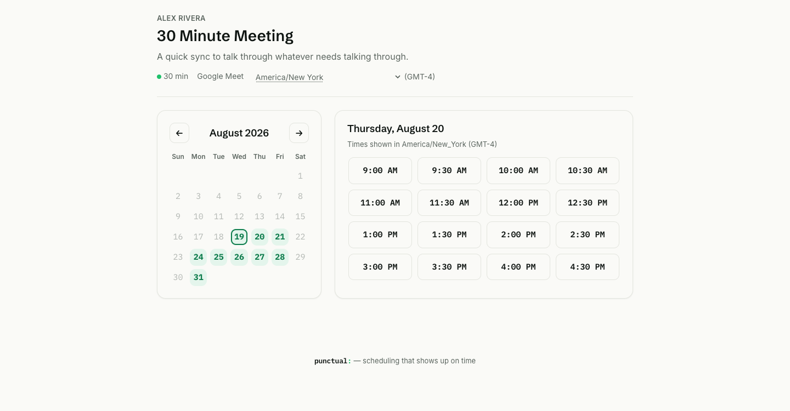

<p align="center">
  <picture>
    <source media="(prefers-color-scheme: dark)" srcset="assets/brand/wordmark-dark.svg">
    <source media="(prefers-color-scheme: light)" srcset="assets/brand/wordmark-light.svg">
    
  </picture>
</p>

[](https://github.com/CCCrafts/punctual/actions/workflows/ci.yml)
[](LICENSE)

**Scheduling that shows up on time.**

Punctual is an open, edge-native scheduler — a full single-team alternative to
Calendly that runs entirely on Cloudflare Workers. Booking pages render at the
edge; self-hosting is one `wrangler deploy` into your own Cloudflare account,
$0 on the free tier.

> **Status:** pre-release, under active development. The engine deploys and
> takes bookings; interfaces may still change before 1.0.

## What it looks like

A booking page, rendered at the edge — no client-side spinner between the
guest picking a day and seeing open times.



## The pledge

The open-source version is complete for a single team — forever. No seat
limits, no gated scheduling features, no "non-production use" clauses.
MIT makes this promise irrevocable: what we ship can never be taken back.

## Quick start

```bash
git clone https://github.com/CCCrafts/punctual.git
cd punctual && npm install
npx wrangler login

npx wrangler d1 create punctual          # put the id in wrangler.toml
npx wrangler kv namespace create CACHE   # put the id in wrangler.toml
npx wrangler r2 bucket create punctual-avatars   # put the name in wrangler.toml

openssl rand -base64 32 | npx wrangler secret put ENCRYPTION_KEY_V1
openssl rand -base64 32 | npx wrangler secret put SIGNING_KEY

npm run migrate
npm run deploy   # prints your Worker URL — put it in wrangler.toml's BASE_URL
npm run deploy   # again, so emailed links point at the real URL
```

Full walkthrough, including connecting Google and Microsoft calendars:
[docs/self-hosting.md](docs/self-hosting.md).

## What's here

- **Booking pages** rendered and streamed from the edge
- **Google Calendar and Microsoft 365** sync, using your own OAuth app
- **Event types** with buffers, notice windows, horizons, daily caps, custom
  questions
- **Teams** — round-robin and collective scheduling
- **Emails with .ics invites**, reschedule and cancel links, 24 h and 1 h
  reminders
- **REST API**, HMAC-signed webhooks, embed widget
- **A built-in MCP server** — your calendar as a tool an AI agent can call

## How it works

Three decisions shape everything else.

**Double-booking is impossible at the storage layer, not by convention.**
Every booking writes one row per five-minute bucket per host into a
`slot_locks` table whose primary key is `(host_user_id, bucket_start)`, in the
same D1 `batch()` as the booking itself. A conflicting bucket violates the
constraint and the whole batch rolls back. Range overlap can't be expressed as
a SQL constraint; discretised buckets can — that substitution is the design.
Durable Objects serialise attempts and re-check external calendars, but they
are the fast path, not the guarantee: if they misbehave the worst outcome is a
409.

**All time is UTC internally; wall-clock exists only at the edges.** Daylight
saving is handled by explicit rules rather than by hope — a wall-clock time
inside a spring-forward gap clamps forward, an ambiguous time during
fall-back takes the first occurrence, and both rules apply uniformly to window
starts and ends. The test matrix covers Kyiv, New York, Lord Howe (a
30-minute DST shift), Chatham (+12:45), Kolkata and the southern hemisphere,
because whole-hour assumptions fail silently rather than loudly.

**The engine takes everything through ports.** Storage, calendars, email,
crypto, cache, clock and queue all arrive as interfaces, so the same engine
runs single-tenant for you and multi-tenant for a hosted service without a
fork. There is deliberately no "limits" or "plan" interface anywhere in this
repository — see the pledge.

## Development

```bash
npm test              # 454 tests
npm run test:core     # pure domain only — no Workers runtime, runs in ~150ms
npm run typecheck
npm run dev
```

The domain layer has zero Cloudflare imports and runs under plain Node, which
is what lets the timezone and slot-engine suites stay exhaustive and fast.
Adapters, Durable Objects and HTTP are tested against the real Workers runtime
with Miniflare.

## License

[MIT](LICENSE). A hosted version with managed OAuth apps, custom domains and
zero setup is a separate commercial service running on this same engine.
